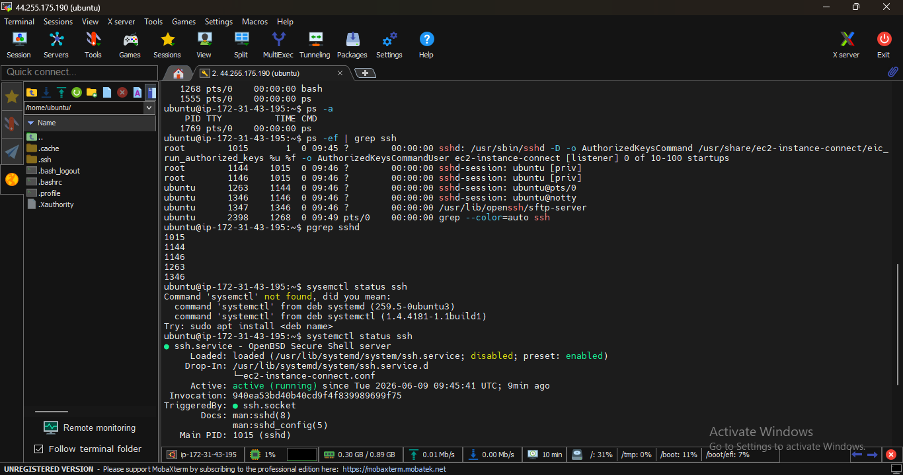

Service selected is a SSH for practice
# Process Inspection
- ps: it shows running process in linux
- ps -ef | grep ssh : it is used to check running processes related to ssh. The sshd process is running which indicates ssh is running
- pgrep sshd: Find process ID of ssh .
- 

# Service Commands
- systemctl status ssh: Check SSH Service Status and ts verify ssh is running successfully.
- systemctl list-units --type=service : It lists active services.
# Log Commands 
 - journalctl -u ssh -n 10 : It is used to view logs of ssh. The logs confirm that the SSH service is listening on port 22 and accepting connections.
- tail -n 20 /var/log/syslog : To view recent system logs. Its includes successful ssh authentication
 # Mini Troubleshooting Steps 
 - Suppose issue is unable to connect ssh then
 - Verify process by using pgrep sshd it will show PID if PId is not displayed means ssh is not running
 - Check service status by using systemctl status ssh command. Verify that the service state is active (running)
 - Review service logs by using journalctl -u ssh -n 20 command. Check logs for authentication failure , service setup errors.
 - verify service again by systemctl status ssh command and confirms its running.
    

